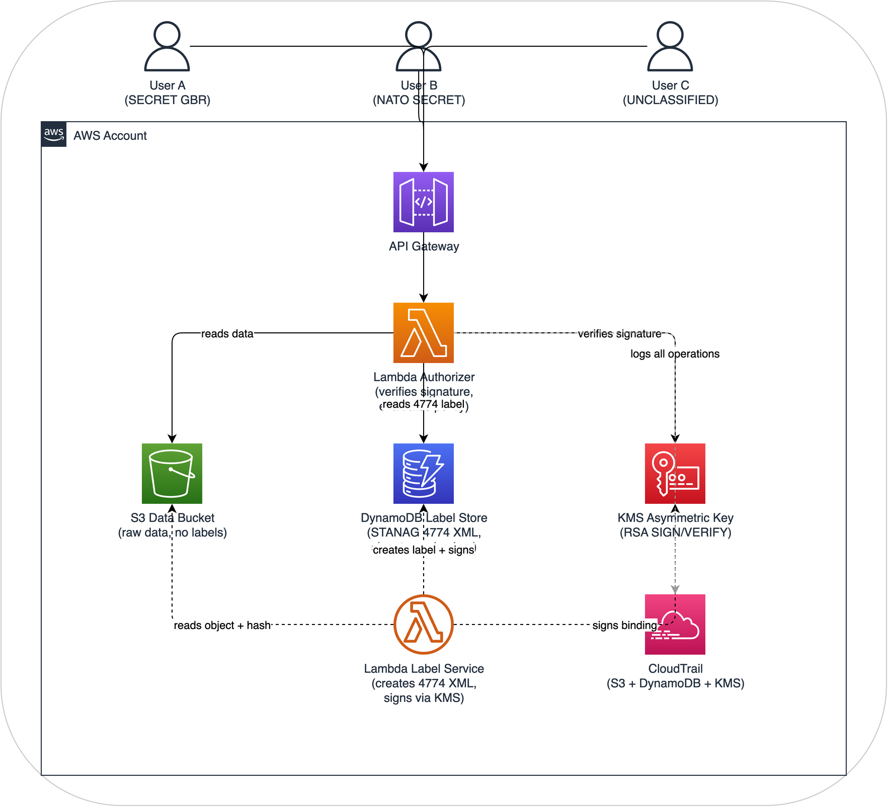
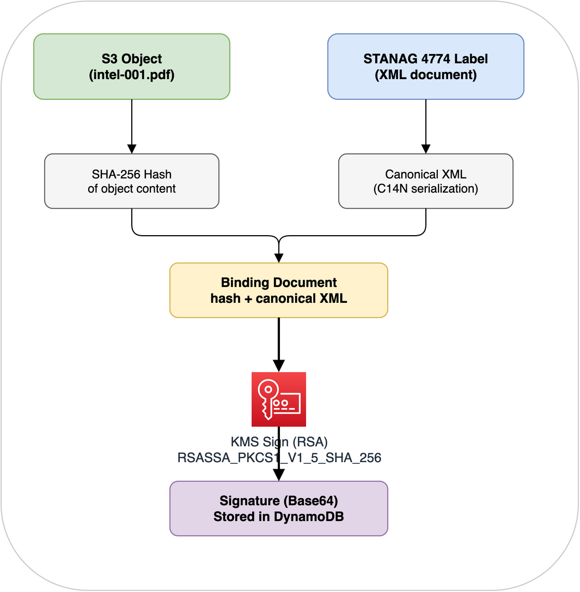

# Architecture: Assured DCS Level 1 - STANAG-compliant labeling on AWS

## Purpose

This architecture implements **Assured DCS Level 1 (Control/Labeling)** on AWS, compliant with NATO STANAG 4774 (Confidentiality Metadata Label Syntax) and STANAG 4778 (Metadata Binding Mechanism).

Unlike the basic Level 1 architecture (which uses S3 tags as advisory labels), this one adds:
- STANAG 4774 XML labels with proper PolicyIdentifier, Classification, and Category elements
- STANAG 4778 cryptographic binding using XML Digital Signatures (XMLDSig) backed by AWS KMS asymmetric keys
- Tamper-evident label storage in DynamoDB with signature verification on every access
- Label integrity verification, so any modification to data or labels is cryptographically detectable

After building this, you'll understand:
- How STANAG 4774 labels are structured and why the format matters for interoperability
- How STANAG 4778 binds labels to data using digital signatures
- How AWS KMS asymmetric keys provide HSM-backed signing without managing your own PKI
- Why DynamoDB (not S3 sidecar objects) is the right label store for queryability and access control
- The difference between "basic" and "assured" DCS Level 1

## Why DynamoDB instead of S3 sidecar objects?

A common approach to storing structured metadata alongside S3 objects is to use sidecar objects (e.g., `intel-001.pdf.label.xml` next to `intel-001.pdf`). This has significant drawbacks for DCS:

| Concern | Sidecar Objects | DynamoDB Label Store |
|---|---|---|
| Atomic operations | No, data and label are separate PutObject calls; race conditions possible | Yes, label record is a single atomic write |
| Access control separation | Hard, same S3 bucket permissions apply to data and labels | Easy, separate IAM policies for DynamoDB vs S3 |
| Queryability | Poor, must list and read every sidecar to find "all SECRET documents" | Native, DynamoDB GSI queries by classification, releasability, originator |
| **Label tampering** | Anyone with S3 write access can overwrite the sidecar | DynamoDB IAM + condition expressions restrict label mutation; signatures detect tampering |
| **Cost at scale** | Doubles object count; S3 LIST operations become expensive | DynamoDB on-demand pricing; efficient point reads |
| Versioning | Must manage version alignment between data object and sidecar | Label version history in DynamoDB with timestamps |

The DynamoDB approach also aligns with the well-established AWS pattern of using DynamoDB as a metadata store for S3 objects (used by Dropbox, Netflix, and others at scale).

## Architecture Overview



## How it achieves assured DCS Level 1

| DCS Requirement | STANAG | Implementation |
|---|---|---|
| **Structured label syntax** | 4774 | XML labels with PolicyIdentifier, Classification, Category elements |
| **Machine-readable labels** | 4774 | Labels stored as XML in DynamoDB, parseable by any STANAG 4774 implementation |
| **Cryptographic binding** | 4778 | SHA-256 hash of data + XML label signed using KMS RSA key (XMLDSig-equivalent) |
| Tamper detection (data) | 4778 | Data hash included in signed binding; any data modification invalidates signature |
| Tamper detection (label) | 4778 | Label XML included in signed binding; any label modification invalidates signature |
| **Signer identity** | 4778 | KMS key ARN identifies the signing authority; CloudTrail logs who invoked Sign |
| **Label independence** | 4774 | Labels stored separately from data; can be queried, audited, and managed independently |
| **Interoperability** | 4774 | XML label format can be extracted and sent to any STANAG 4774-compliant system |

## What this architecture does NOT do

- It does not encrypt data (that's DCS Level 3 / ZTDF)
- It does not use X.509 PKI certificates for signing. It uses AWS KMS asymmetric keys as a pragmatic alternative. A production NATO system would use national PKI certificates; KMS demonstrates the same cryptographic principles.
- It does not implement full XMLDSig enveloped signatures. It uses a JSON binding document that references the 4774 XML label and data hash, signed by KMS. This is functionally equivalent to STANAG 4778 detached signatures while being more natural for AWS/cloud environments.
- This is a learning/demonstration environment, not accredited for real classified data

## Components

### 1. S3 Data Bucket

Stores raw data objects only. Unlike the basic architecture, objects do NOT carry their own labels as S3 tags. Labels live in DynamoDB with cryptographic binding.

The bucket enforces:
- Versioning (every version gets its own label binding)
- SSE-KMS encryption at rest
- Public access blocked
- EventBridge notifications on PutObject (triggers labeling)

### 2. DynamoDB Label Store

The central label registry. Each item represents a STANAG 4774 label bound to an S3 object.

**Table schema:**

| Attribute | Type | Description |
|---|---|---|
| `object_key` | String (PK) | S3 object key |
| `object_version` | String (SK) | S3 version ID |
| `label_xml` | String | STANAG 4774 XML label (full XML document) |
| `data_hash` | String | SHA-256 hash of the S3 object content |
| `binding_signature` | String | Base64-encoded KMS signature over (label_xml + data_hash) |
| `signing_key_arn` | String | ARN of the KMS key used to sign |
| `signed_at` | String | ISO 8601 timestamp of signing |
| `signed_by` | String | IAM principal that invoked the labeling |
| `label_version` | Number | Incrementing version for label updates |
| `classification` | String | Denormalized for GSI queries |
| `releasable_to` | StringSet | Denormalized for GSI queries |
| `originator` | String | Denormalized for GSI queries |

**Global Secondary Indexes:**
- `classification-index`: Query all objects at a given classification level
- `originator-index`: Query all objects by originating nation

**Why denormalize?** The canonical label is always the `label_xml` field (STANAG 4774 format). The denormalized fields exist purely for efficient DynamoDB queries. The authorizer always parses and verifies the XML label, never trusts the denormalized fields alone.

### 3. KMS Asymmetric Signing Key

An AWS KMS key configured for asymmetric signing:
- **Key spec**: `RSA_2048` (or `RSA_4096` for higher assurance)
- **Key usage**: `SIGN_VERIFY`
- **Signing algorithm**: `RSASSA_PKCS1_V1_5_SHA_256`

Why KMS rather than self-managed keys?
- Private key material never leaves the HSM and cannot be extracted or exfiltrated
- CloudTrail logs every Sign and Verify operation
- Key rotation and access policies managed via IAM
- The public key can be exported for offline/external verification

In a production NATO environment, you would use national PKI certificates (e.g., issued by a national COMSEC authority). KMS demonstrates the same cryptographic binding principle with the operational simplicity of a managed service.

### 4. Lambda Label Service

Triggered when new objects are uploaded to S3 (via EventBridge). Creates the STANAG 4774 label and 4778 binding.

**Flow:**
1. Receive S3 PutObject event
2. Read the object content and compute SHA-256 hash
3. Analyze content for classification indicators (or accept explicit classification from upload metadata)
4. Generate STANAG 4774 XML label
5. Create binding document: concatenate canonical label XML + data hash
6. Sign binding document using KMS asymmetric key
7. Store label, hash, and signature in DynamoDB

### 5. Lambda Authorizer

Evaluates access requests by verifying the cryptographic binding before making policy decisions.

**Flow:**
1. Extract user identity and requested object key
2. Read label record from DynamoDB
3. **Verify signature**: Re-compute binding document from stored label_xml + data_hash, verify against stored signature using KMS public key
4. **Verify data integrity**: Compute SHA-256 of the actual S3 object, compare to signed data_hash
5. **Parse STANAG 4774 label**: Extract classification, releasability, SAPs from XML
6. **Evaluate policy**: Compare user attributes against label requirements
7. Return allow/deny with full audit context

If signature verification fails at step 3 or data integrity fails at step 4, access is always denied regardless of user clearance. This is the "assured" part: tampered labels or data are cryptographically detected.

### 6. CloudTrail Audit

Captures audit logs across all services:
- S3 data access attempts
- DynamoDB label reads and writes
- KMS Sign and Verify operations
- API Gateway authorization decisions
- Lambda invocations with full context

## STANAG 4774 label format

Every label in this architecture follows the STANAG 4774 XML structure:

```xml
<?xml version="1.0" encoding="UTF-8"?>
<ConfidentialityLabel
    xmlns="urn:nato:stanag:4774:confidentialitymetadatalabel:1:0"
    xmlns:xsi="http://www.w3.org/2001/XMLSchema-instance">
  <ConfidentialityInformation>
    <PolicyIdentifier>urn:nato:stanag:4774:confidentialitymetadatalabel:1:0:policy:NATO</PolicyIdentifier>
    <Classification>SECRET</Classification>
    <Category TagName="ReleasableTo" Type="PERMISSIVE">
      <CategoryValue>GBR</CategoryValue>
      <CategoryValue>USA</CategoryValue>
      <CategoryValue>POL</CategoryValue>
    </Category>
    <Category TagName="SpecialAccessProgram" Type="RESTRICTIVE">
      <CategoryValue>WALL</CategoryValue>
    </Category>
  </ConfidentialityInformation>
  <CreationDateTime>2026-03-21T10:30:00Z</CreationDateTime>
  <Originator>GBR</Originator>
</ConfidentialityLabel>
```

**Key elements:**
- `PolicyIdentifier`: Specifies which classification scheme applies (NATO, national, etc.)
- `Classification`: The formal classification level from the policy vocabulary
- `Category` with `Type="PERMISSIVE"`: Releasability, user must match at least one value
- `Category` with `Type="RESTRICTIVE"`: SAPs, user must hold the specific access
- `CreationDateTime`: When the label was created (supports label lifecycle)
- `Originator`: The nation/organization that created the label

## STANAG 4778 binding mechanism

The binding ties the label to the data cryptographically. This architecture uses a detached signature approach:



**Verification** reverses this process:
1. Read label XML and data hash from DynamoDB
2. Reconstruct the binding document
3. Call KMS Verify (or use the exported public key locally)
4. Independently hash the S3 object and compare to the signed hash

If either the label or the data has been modified since signing, verification fails.

## Classification vocabulary

This architecture supports both NATO and national classification schemes via the PolicyIdentifier:

| PolicyIdentifier | Classifications |
|---|---|
| `...policy:NATO` | NATO UNCLASSIFIED, NATO RESTRICTED, NATO CONFIDENTIAL, NATO SECRET, COSMIC TOP SECRET |
| `...policy:GBR` | OFFICIAL, SECRET, TOP SECRET |
| `...policy:USA` | UNCLASSIFIED, CONFIDENTIAL, SECRET, TOP SECRET |

The Lambda authorizer maps across these schemes using a classification equivalence table, similar to how NATO nations map their national classifications to NATO levels.

## What you'll learn

After building this architecture, you'll understand:

1. Labels are structured, not flat. STANAG 4774 XML labels carry policy information that flat key-value tags can't express (compound categories, policy identifiers, typed categories).

2. Binding creates trust. Without STANAG 4778 binding, labels are just metadata that anyone can change. With binding, any tampering is cryptographically detectable.

3. Data and labels are separated. Data lives in S3, labels live in DynamoDB. This separation allows independent access control, querying, and lifecycle management.

4. KMS works as a signing authority. AWS KMS asymmetric keys provide HSM-backed digital signatures without the complexity of running your own PKI. The public key can be exported for external verification.

5. "Assured" matters for coalition operations. When sharing data between nations, you need cryptographic proof that labels haven't been tampered with. Advisory labels aren't sufficient for cross-boundary trust.

6. This is the path to DCS Level 2 and 3. Assured labeling is the foundation. Level 2 adds ABAC enforcement based on these labels. Level 3 (ZTDF) adds encryption with the labels embedded in the encrypted wrapper.

## Estimated cost

Running this architecture in AWS costs approximately $10-25/month for demonstration purposes:
- DynamoDB on-demand: ~$1-2/month for demo workloads
- KMS asymmetric key: $1/month per key + $0.15 per 10,000 Sign/Verify operations
- Lambda, API Gateway, S3, CloudTrail: similar to basic Level 1

## Terraform overview

See `terraform.md` for the complete infrastructure-as-code including:
- DynamoDB table with GSIs
- KMS asymmetric signing key
- Lambda functions for labeling and authorization
- S3 bucket with EventBridge integration
- Full IAM policies with least-privilege access
