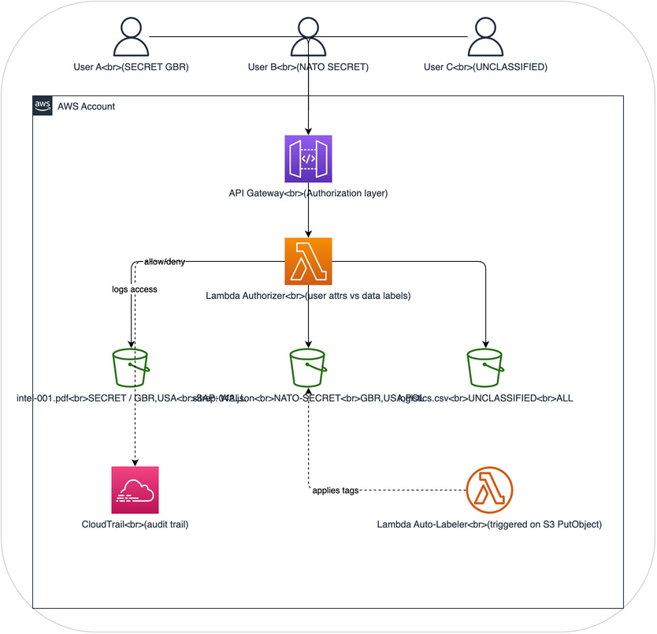

# Architecture: DCS Level 1 - Data labeling and classification on AWS

## Purpose

This architecture implements **DCS Level 1 (Control/Labeling)** using native AWS services. It shows how security metadata can be attached to data objects and used for access decisions, which is the foundation of all data-centric security.

After building it, you'll understand:
- How security labels travel with data (not just protect the perimeter)
- How labels enable automated access decisions
- How audit trails capture who accessed what and why
- Why labeling is the first step before any DCS protection

## Architecture Overview

## How it demonstrates DCS Level 1

| DCS Concept | AWS Implementation |
|---|---|
| **Security labels** | S3 object tags (classification, releasable-to, sap, originator) |
| **Labels travel with data** | S3 tags are part of the object metadata - they move when objects are copied |
| **Access decisions from labels** | Lambda authorizer reads tags and compares to user attributes |
| **Audit trail** | CloudTrail logs every access attempt with label information |
| **Automated labeling** | Lambda auto-labeler applies labels based on content analysis |

## What this architecture does NOT do

- It does not encrypt data (that's DCS Level 3)
- It does not cryptographically bind labels to data (labels are advisory, not assured)
- Tags can be modified by anyone with S3 tagging permissions (no integrity protection)
- This is a learning/demonstration environment, not production-grade

## Components

### 1. S3 Data Bucket
The central data store where labeled objects reside. Each object has S3 tags representing its security label.

**Tag schema** (modeled on STANAG 4774 concepts):
| Tag Key | Values | Description |
|---------|--------|-------------|
| `dcs:classification` | UNCLASSIFIED, OFFICIAL, SECRET, TOP-SECRET | Classification level |
| `dcs:releasable-to` | Comma-separated country codes (GBR, USA, POL) | Releasability |
| `dcs:sap` | SAP codeword or NONE | Special Access Program |
| `dcs:originator` | Country code | Data originator |
| `dcs:created` | ISO 8601 timestamp | When label was applied |
| `dcs:label-version` | Integer | Label version for tracking changes |

### 2. API Gateway + Lambda Authorizer
The access control layer that evaluates user attributes against object labels before allowing access.

**Flow**:
1. User makes GET request to `/objects/{object-key}` with bearer token
2. Lambda authorizer extracts user attributes from token (clearance, nationality, SAPs)
3. Lambda reads S3 object tags for the requested object
4. Lambda evaluates policy: does user clearance >= object classification? Is user nationality in releasable-to? Does user have required SAP?
5. Returns allow (200) or deny (403)

### 3. Lambda Auto-Labeler
Triggered when new objects are uploaded to S3. Analyzes content and applies appropriate tags.

**Analysis rules** (configurable):
- Files containing "SECRET" or "CONFIDENTIAL" markers get corresponding classification
- Files with grid references or coordinate data get minimum SECRET
- Files referencing SAP codewords get SAP tags
- Default: UNCLASSIFIED if no indicators found

### 4. CloudTrail Audit
Captures audit logs for every operation:
- Who requested access (IAM identity)
- What they requested (S3 object key)
- What labels the object had (captured in Lambda logs)
- Whether access was granted or denied
- Timestamp and source IP

### 5. IAM Users/Roles (Simulating Coalition Personnel)
Three IAM roles simulating users with different clearance levels:
- **user-gbr-secret**: UK user with SECRET clearance
- **user-nato-secret**: NATO user with NATO SECRET clearance
- **user-unclass-contractor**: Contractor with UNCLASSIFIED access only

## What you'll learn

After building and using this architecture, you'll understand:

1. Labels are metadata, not protection. Without encryption, labels are advisory. Anyone with S3 access can read the data regardless of labels. The Lambda authorizer enforces labels, but the data itself isn't protected.

2. Labels enable policy decisions. By reading labels at access time, the system makes dynamic decisions about who can see what. This is different from static permissions.

3. Labels must travel with data. When you copy an S3 object with tags, the labels go with it. This is the DCS principle that protection travels with data.

4. Audit is non-negotiable. Without audit trails, you can't prove who accessed what. CloudTrail provides this automatically.

5. You'll need DCS Level 2 and 3. This architecture shows the limitations of labels alone: they can be tampered with, they don't protect data, and enforcement depends on the application layer.

## Terraform overview

See `terraform/` for the complete infrastructure-as-code. Key resources:
- `aws_s3_bucket` with versioning and tagging
- `aws_api_gateway_rest_api` with Lambda authorizer
- `aws_lambda_function` for authorizer and auto-labeler
- `aws_cloudtrail` for audit logging
- `aws_iam_role` for simulated users
- S3 bucket policy requiring tagging on all PutObject operations

## Estimated cost

Running this architecture in AWS costs approximately $5-15/month for demonstration purposes (mainly API Gateway, Lambda invocations, and S3 storage). CloudTrail has a free tier for the first trail.
