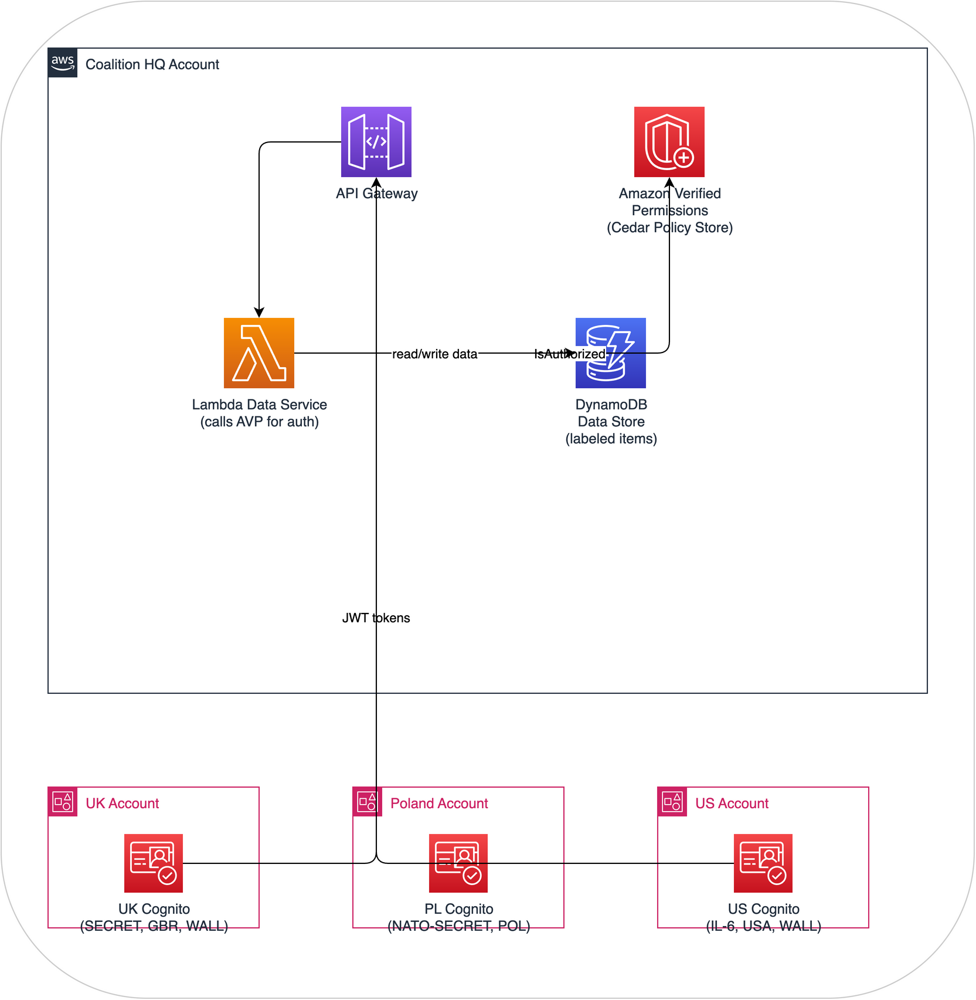

# Architecture: DCS Level 2 - Attribute-based access control on AWS

## Purpose

This architecture implements **DCS Level 2 (Protection via Access Control)** on AWS. It builds on Level 1 labeling by adding policy-based access control where a dedicated policy engine evaluates access requests using user attributes and data labels.

After building it, you'll understand:
- How ABAC differs from traditional RBAC (and why it matters for DCS)
- How a Policy Decision Point (PDP) evaluates complex access rules
- How cross-account data sharing works with consistent ABAC policies
- How to implement the "share" pillar of DCS with multiple organizations using different attribute schemas

## Architecture Overview


## How It Demonstrates DCS Level 2
| DCS Concept | AWS Implementation |
|---|---|
| **ABAC policies** | Amazon Verified Permissions with Cedar policies |
| **Policy Decision Point** | AVP evaluates access requests against Cedar policies |
| **User attributes** | Cognito user pool custom attributes (clearance, nationality, SAPs) |
| **Data labels** | DynamoDB item attributes (classification, releasableTo, sap) |
| **Cross-org sharing** | Multiple Cognito pools (simulating nations) federated to single AVP |
| **Audit trail** | CloudWatch Logs + AVP decision logging |

## How it differs from Level 1

In Level 1, the Lambda authorizer contained hard-coded comparison logic. In Level 2:
- **Policies are externalized** in Amazon Verified Permissions (Cedar)
- **Policies are declarative** - you describe what's allowed, not how to check
- **Policies are testable** - Cedar supports policy simulation before deployment
- **Policies are auditable** - every decision is logged with the full evaluation context
- **Policies support complex rules** - beyond simple comparison (hierarchy, unions, exceptions)

## Components

### 1. Amazon Verified Permissions (Policy Decision Point)

The Cedar policy store contains policies that implement NATO-style access control rules:

```cedar
// Base access rule - clearance and nationality check
permit(
  principal,
  action == Action::"read",
  resource
) when {
  // Clearance hierarchy check
  principal.clearanceLevel >= resource.classificationLevel
  // Nationality must be in releasable-to list
  && resource.releasableTo.contains(principal.nationality)
  // SAP check - either no SAP required or user has it
  && (resource.requiredSap == "" || principal.saps.contains(resource.requiredSap))
};

// Originator always has access to their own data
permit(
  principal,
  action == Action::"read",
  resource
) when {
  principal.nationality == resource.originator
};

// Deny rule - explicitly block access if clearance revoked
forbid(
  principal,
  action,
  resource
) when {
  principal.clearanceRevoked == true
};
```

**Clearance hierarchy** (encoded as numeric levels for comparison):
| Level | Value | NATO Equivalent |
|-------|-------|-----------------|
| UNCLASSIFIED | 0 | NATO UNCLASSIFIED |
| OFFICIAL | 1 | NATO RESTRICTED |
| SECRET | 2 | NATO SECRET |
| TOP-SECRET | 3 | COSMIC TOP SECRET |

### 2. Multi-Account Cognito Federation (Simulating Coalition Nations)

Three separate Cognito User Pools, each representing a nation's identity provider:

**UK User Pool** - Custom attributes:
- `custom:clearance` = "SECRET" (mapped to level 2)
- `custom:nationality` = "GBR"
- `custom:saps` = "WALL" (comma-separated list)
- `custom:organisation` = "UK-MOD"

**Poland User Pool** - Custom attributes:
- `custom:clearance` = "NATO-SECRET" (mapped to level 2)
- `custom:nationality` = "POL"
- `custom:saps` = ""
- `custom:organisation` = "PL-MON"

**US User Pool** - Custom attributes:
- `custom:clearance` = "IL-6" (mapped to level 2)
- `custom:nationality` = "USA"
- `custom:saps` = "WALL"
- `custom:organisation` = "US-DOD"

Each pool issues JWTs that the API Gateway validates. The Lambda function extracts attributes from the JWT and passes them to AVP for authorization.

### 3. DynamoDB Data Store

Each data item has both a payload and DCS label attributes:

```json
{
  "dataId": "intel-report-001",
  "classification": "SECRET",
  "classificationLevel": 2,
  "releasableTo": ["GBR", "USA", "POL"],
  "requiredSap": "NONE",
  "originator": "POL",
  "created": "2025-03-15T10:30:00Z",
  "labelVersion": 1,
  "payload": "Enemy forces observed moving through northern sector..."
}
```

### 4. Lambda Data Service

Orchestrates the access flow:
1. Extracts user attributes from JWT token
2. Looks up data item labels from DynamoDB
3. Calls Amazon Verified Permissions `IsAuthorized` API
4. If authorized: returns data payload
5. If denied: returns 403 with reason
6. Logs full decision context to CloudWatch

### 5. Classification Mapping Service

A Lambda function that maps between national classification systems:

```json
{
  "mappings": {
    "GBR": { "OFFICIAL": 1, "SECRET": 2, "TOP-SECRET": 3 },
    "POL": { "NATO-RESTRICTED": 1, "NATO-SECRET": 2, "COSMIC-TOP-SECRET": 3 },
    "USA": { "IL-4": 1, "IL-5": 2, "IL-6": 2, "IL-7": 3 }
  }
}
```

## Scenarios to Demonstrate
### Scenario A: Standard Access Grant
- Polish user (NATO SECRET) requests intel-report-001 (SECRET, releasable to GBR/USA/POL)
- AVP evaluates: clearance 2 >= classification 2, POL in releasableTo, no SAP required
- Result: **ACCESS GRANTED**

### Scenario B: Access Denied - Nationality
- Polish user requests uk-eyes-only-002 (SECRET, releasable to GBR only)
- AVP evaluates: clearance OK, but POL not in releasableTo [GBR]
- Result: **ACCESS DENIED** - nationality not in releasable-to list

### Scenario C: Access Denied - SAP
- Polish user (no SAPs) requests wall-report-003 (SECRET, SAP: WALL)
- AVP evaluates: clearance OK, nationality OK, but user lacks WALL SAP
- Result: **ACCESS DENIED** - missing required SAP

### Scenario D: Originator Override
- Polish user requests any Polish-originated data
- AVP evaluates originator rule: user nationality == data originator
- Result: **ACCESS GRANTED** regardless of other restrictions

### Scenario E: Dynamic Policy Update
- Admin adds new Cedar policy granting temporary access during exercise
- Existing data immediately affected by new policy (no re-labeling needed)
- Policy change logged in AVP audit trail

## What you'll learn

After building and using this architecture, you'll understand:

1. ABAC is more flexible than RBAC. Instead of defining roles for every combination (UK-SECRET-WALL, US-IL6-WALL, etc.), ABAC policies evaluate attributes dynamically. This scales to any number of nations and clearance combinations.

2. Policy externalization matters. Policies in Cedar are separate from application code. They can be updated, tested, and audited independently.

3. Classification mapping is necessary. Different nations use different classification systems. Mapping them to a common hierarchy enables interoperable access control.

4. Policies persist with data. Because labels are on the data and policies are in the PDP, access control applies regardless of where the data is stored or how it's accessed.

5. You still need DCS Level 3. Even with ABAC, the data itself is not encrypted. Anyone with direct DynamoDB access can read all data. The access control depends on the application layer enforcing it.

## Terraform overview

See `terraform/` for complete IaC. Key resources:
- `aws_verifiedpermissions_policy_store` with Cedar policies
- `aws_cognito_user_pool` x 3 (UK, Poland, US)
- `aws_dynamodb_table` for labeled data
- `aws_api_gateway_rest_api` with Cognito authorizer
- `aws_lambda_function` for data service
- `aws_cloudwatch_log_group` for audit

## Estimated cost

Approximately $10-25/month for demonstration use. Amazon Verified Permissions charges per authorization request ($0.15 per 1000 requests). Cognito has a free tier for up to 50,000 monthly active users.
