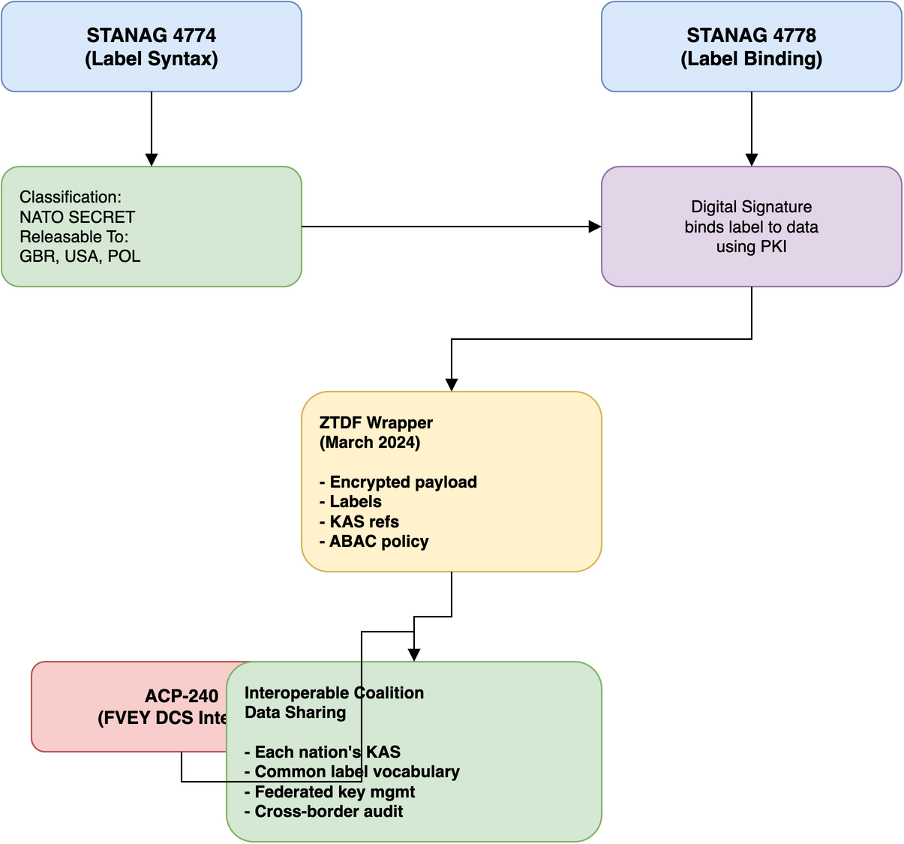

# NATO STANAGs for Data-Centric Security

## Important note on STANAG availability

NATO STANAGs are generally **not publicly downloadable**. They are NATO UNCLASSIFIED or NATO RESTRICTED documents distributed through official NATO channels. This document provides reference information about each relevant STANAG based on publicly available summaries, academic papers, and defence industry publications.

To obtain full STANAG documents, contact your national NATO delegation or search the NATO Standardization Office (NSO) standards database at [https://nso.nato.int/nso/nsdd/main/standards](https://nso.nato.int/nso/nsdd/main/standards) (search by standard number, e.g. `4778` for STANAG 4778).

## Core DCS STANAGs
### STANAG 4774 - Confidentiality Metadata Label Syntax
- **Allied Data Publication**: ADatP-4774
- **Title**: Confidentiality Metadata Label Syntax
- **Edition**: Edition A, Version 1
- **Status**: Promulgated
- **Classification**: NATO UNCLASSIFIED

**What it covers**:
STANAG 4774 defines a standardized syntax for expressing confidentiality labels as structured metadata. It provides an XML-based format for encoding:
- Classification levels (e.g., NATO UNCLASSIFIED, NATO RESTRICTED, NATO SECRET, COSMIC TOP SECRET)
- Policy identifiers (which classification system applies)
- Category markings (caveats, releasability, special access programs)
- Creation and expiry timestamps for labels

**Structure of a 4774 label**:
```xml
<ConfidentialityLabel xmlns="urn:nato:stanag:4774:confidentialitymetadatalabel:1:0">
  <ConfidentialityInformation>
    <PolicyIdentifier>urn:nato:stanag:4774:confidentialitymetadatalabel:1:0:policy:NATO</PolicyIdentifier>
    <Classification>SECRET</Classification>
    <Category TagName="ReleasableTo" Type="PERMISSIVE">
      <CategoryValue>GBR</CategoryValue>
      <CategoryValue>USA</CategoryValue>
      <CategoryValue>POL</CategoryValue>
    </Category>
  </ConfidentialityInformation>
</ConfidentialityLabel>
```

**Relevance to DCS**: This is the foundation of DCS Level 1 (Control/Labeling). Without standardized labels, systems can't make consistent access control or protection decisions. Every DCS implementation starts with labeling data according to STANAG 4774.

**Key concepts**:
- Labels are machine-readable metadata, not just human-readable markings
- Labels can express complex policies (multiple categories, compound rules)
- Labels are independent of the data format they describe
- Labels support both NATO and national classification schemes
- **Portion-level labelling** -- different sections of a document can carry different classifications
- **Common security policy model** -- Security Policy Information Files (SPIFs) provide machine-readable policy definitions
- **Alternative Confidentiality Labels** -- support for cross-domain scenarios where multiple labelling policies apply simultaneously

**ADatP-4774 family**:

- ADatP-4774 (Edition A) -- Core label syntax specification
- ADatP-4774.2 -- Implementation guidance for applying labels in practice
- ADatP-4774.4 -- Additional guidance on label usage

---

### STANAG 4778 - Metadata Binding Mechanism
- **Allied Data Publication**: ADatP-4778
- **Title**: Metadata Binding Mechanism
- **Edition**: Edition A, Version 1
- **Status**: Promulgated
- **Classification**: NATO UNCLASSIFIED

**What it covers**:
STANAG 4778 defines a complete framework for formally associating metadata (including STANAG 4774 confidentiality labels) with the data they describe. It is significantly broader than just cryptographic signing -- it defines:

1. **Explicit relationship statements** -- every binding must state *what relationship* the metadata has to the data (e.g., "this label asserts the classification of this data")
2. **Three binding approaches**:
    - **Encapsulating** -- the binding wraps both data and metadata into a single signed package
    - **Embedded** -- the binding lives inside the data object itself (e.g., a signed XML element within a larger document)
    - **Detached** -- the binding is stored separately from both metadata and data, referencing each by identifier or hash
3. **Cryptographic integrity** -- digital signatures (XMLDSig or JWS) ensure labels cannot be modified or removed without detection
4. **Non-cryptographic bindings** -- supports algorithm="none" for environments where integrity is assured by other means (e.g., a trusted system boundary)
5. **Granular sub-document binding** -- different labels can be bound to different portions of structured data, with four inheritance rules defining how child elements relate to parent labels

**Binding granularity**:
A critical capability of 4778 is binding metadata at sub-document level. For structured data (XML messages, C2 reports, databases), you can bind different security labels to individual fields or sections. This enables the "redact-before-sending" pattern: a gateway can strip or withhold specific portions of a message based on the recipient's clearance, because each portion has its own binding that declares its classification.

**Relevance to DCS**: STANAG 4778 enables both DCS Level 1 (assured labelling with cryptographic integrity) and DCS Level 2 (granular labelling that supports portion-level access control). Without binding, labels are advisory metadata that anyone can change. With binding, labels have integrity guarantees and can drive access decisions at field-level granularity.

**Key concepts**:
- Binding creates a trust chain: data -> label -> binding -> signature -> certificate -> trust anchor
- Any modification to data or label invalidates the binding
- Bindings support federation (each organization can add their own bindings)
- Gateways at organizational boundaries can verify bindings and re-bind after transformation
- Granular binding enables redact-before-release for structured data
- 12 binding profiles define how to apply 4778 to specific data formats

**ADatP-4778 family**:

- ADatP-4778 (Edition A) -- Core binding mechanism specification
- ADatP-4778.1 -- Implementation guidance
- ADatP-4778.2 -- Additional implementation guidance
- ADatP-4778.3 -- Binding profiles for specific data formats
- ADatP-4778.7 -- JSON syntax variant (enables binding in JSON/REST environments alongside the XML approach)

---

### STANAG 5663 - Identity, Credential, and Access Management (ICAM)
- **Title**: Identity, Credential, and Access Management including ABAC
- **Status**: Promulgated
- **Classification**: NATO UNCLASSIFIED

**What it covers**:
STANAG 5663 defines how identity and access management works across NATO, including Attribute-Based Access Control (ABAC). It specifies:

- **Identity federation** -- how nations assert identity attributes that other nations can trust
- **Credential management** -- standards for authentication credentials across organizational boundaries
- **ABAC framework** -- how access decisions are made by comparing user attributes (clearance, nationality, role) against data attributes (security labels)
- **Policy Decision Points** -- standardised approach to evaluating access requests against policies

**Relevance to DCS**: STANAG 5663 is the standards-level answer to DCS Level 2. While 4774 provides labels and 4778 binds them to data, 5663 defines how systems make access decisions based on those labels. Without 5663, there is no interoperable way to enforce label-based access control across NATO nations.

**Key concepts**:
- Attributes describe subjects (users), objects (data), and context (environment, time, location)
- Policies compare subject attributes against object labels to produce permit/deny decisions
- Federation allows attributes asserted by one nation to be trusted by another within agreed frameworks
- ABAC scales better than role-based access control for coalition environments with many nations and dynamic missions

---

### ACP-240 - Data-Centric Security Interoperability
- **Title**: Allied Communications Publication 240
- **Origin**: Combined Communications-Electronics Board (CCEB), Five Eyes (FVEY) alliance
- **Status**: Active; effective on receipt for CCEB nations; requires separate NAMILCOM directive for NATO activation
- **Classification**: Varies by section

**What it covers**:
ACP-240 is an Allied Communications Publication developed under the CCEB within the FVEY alliance (Australia, Canada, New Zealand, United Kingdom, United States). It defines data-centric security principles, architecture, and key management for coalition data sharing, including:
- DCS principles and governance controls
- Key management architecture for federated cryptographic protection
- Zero Trust Data Format (ZTDF) encoding specification (Supplements 3 and 4)
- Implementation guidance and interoperability requirements

**Note on governance**: ACP-240 is not a NATO STANAG. It originated from the FVEY community through the CCEB. The NATO STANAGs (4774, 4778) predate ACP-240 by approximately 8 years. A cooperative arrangement between the NATO Digital Policy Committee and the CCEB Data Working Group updated ACP-240 supplements to properly reference and align with these NATO standards -- bringing ACP-240 up to NATO's existing specifications, not the reverse. For NATO nations, ACP-240 becomes effective when directed by NAMILCOM.

**ZTDF (Zero Trust Data Format)**:
ZTDF is defined in ACP-240 Supplements 3 and 4 as one encoding specification for cryptographic data protection. It packages:
- Encrypted data payload (AES-256-GCM)
- STANAG 4774 confidentiality labels
- STANAG 4778 metadata bindings
- Key Access Server (KAS) information for federated key management
- ABAC policy for access decisions at decryption time

ACP-240 explicitly positions ZTDF as one format ("others may be added in future"). ZTDF is built on the open-source OpenTDF specification.

**NATO's position on ZTDF**: NATO has not adopted ZTDF for its DCS framework. From NATO's perspective, ZTDF has specific technical limitations: it provides file-level encryption only (not applicable to structured C2 data requiring granular field-level access), assumes a centralised key management model (conflicting with federated key sovereignty requirements), and addresses Level 3 encryption without solving Level 2 (granular labelling and ABAC). NATO and CCEB are jointly developing federated cryptographic key management standards that will be published as both ACP-240 Supplement 5 and a NATO Allied Data Publication.

**Relevance to DCS**: ACP-240 describes principles for cryptographic data protection and key management. Its ZTDF specification demonstrates one approach to DCS Level 3 for file-level data, though NATO is pursuing broader standards that address structured data and federated key sovereignty.

---

### STANAG 4406 - Military Message Handling System (MMHS)
- **Title**: Military Message Handling System
- **Status**: Promulgated
- **Classification**: NATO UNCLASSIFIED

**What it covers**:
Defines the military messaging standard that commonly carries DCS-labeled data between NATO systems. MMHS messages can include STANAG 4774 confidentiality labels and STANAG 4778 bindings.

**Relevance to DCS**: MMHS is one of the primary transport mechanisms for DCS-protected data in NATO. Understanding how DCS labels travel within MMHS messages is necessary for implementing end-to-end data protection.

---

### STANAG 5516 - Link 16
- **Relevance**: Tactical data links that carry security-labeled tactical data. DCS principles apply to data shared over Link 16 at the tactical edge.

### STANAG 4559 - NATO Standard for Intelligence, Surveillance, and Reconnaissance (ISR) Library Interface
- **Relevance**: Defines how ISR products are stored and shared, including metadata labeling requirements that align with STANAG 4774.

### STANAG 5500 - NATO Message Text Formatting System (FORMETS)
- **Relevance**: Structured message formats that can carry DCS labels as part of formatted military messages.

---

## NATO Core Metadata Specification (NCMS)
- **Version**: 1.0
- **Status**: Published

**What it covers**:
The NCMS defines a common set of metadata elements for describing NATO information resources. It includes:
- Dublin Core-based metadata elements
- NATO-specific extensions for security marking
- Integration with STANAG 4774 for confidentiality labels
- Support for resource discovery and access control

**Relevance to DCS**: NCMS provides the broader metadata framework within which DCS labels (STANAG 4774) operate. It keeps security metadata as part of a complete metadata ecosystem, not isolated from other descriptive metadata.

---

## How these standards work together



## DCS maturity levels mapped to standards

| DCS Level | Capability | Primary Standards |
|-----------|-----------|-------------------|
| Level 1 (Basic) | Metadata labels on data (advisory) | STANAG 4774, NCMS |
| Level 1 (Assured) | Cryptographically bound labels | STANAG 4774 + 4778 |
| Level 2 | Access control based on labels, granular sub-document labelling | STANAG 4774 + 4778 (granular binding) + 5663 (ABAC) |
| Level 3 | Encrypted data with policy enforcement, federated key management | ZTDF (ACP-240), 4774 + 4778 + 5663 |

### NATO DCS maturity timeline (FMN)

| DCS Maturity | Target | Capability |
|---|---|---|
| DCS-1 | 2025 | Basic labelling -- metadata labels applied to data objects |
| DCS-2 | 2028 | Enhanced labelling and access control -- granular labelling, ABAC enforcement |
| DCS-3 | 2033 | Cryptographic protection -- data encrypted with policy-bound keys, federated key management |

## Academic and industry references

These publications provide additional context on NATO DCS standards:

1. Nexor — "The Data-Centric Security Interoperability Dilemma" (publicly available whitepaper)
2. Springer — "Towards Data-Centric Security for NATO Operations" (academic paper)
3. NATO Allied Command Transformation — DCS documentation
4. [OpenTDF Specification](https://github.com/opentdf/spec) — open source, implements ZTDF
5. [Stormshield ZTDF Documentation](https://documentation.stormshield.com/SEP/en/Content/SDK_doc/ztdf.html)
6. NATO Communications and Information Agency (NCIA) — DCS programme publications
