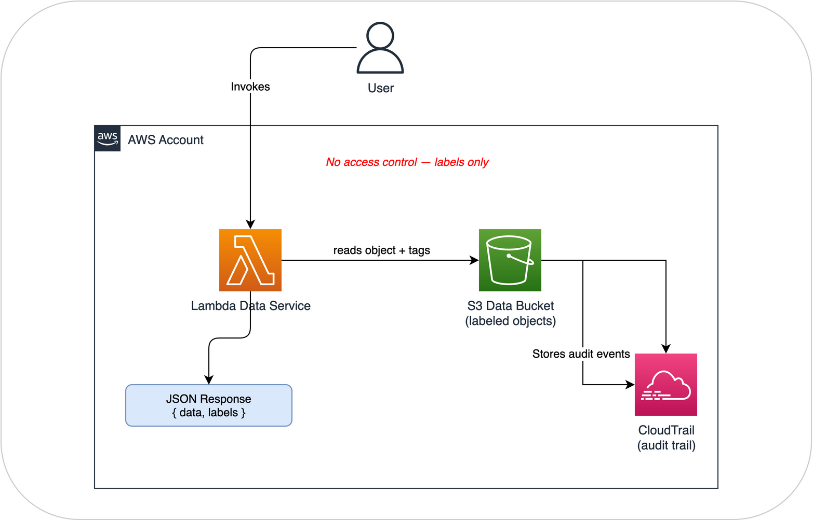

# Lab 1: Data Labeling (DCS Level 1)

## What you'll build

In this lab, you'll create a system where:

1. Data objects in S3 have security labels (as object tags)
2. A Lambda function reads data and returns it along with its labels
3. CloudTrail captures an audit trail of every access

That's it. No access checking, no users with clearances, no allow/deny decisions. This is DCS Level 1: data carries its own security metadata. The labels describe how the data should be handled, but nothing enforces those labels yet.

The point of this lab is to see what labeling gives you and, just as importantly, what it doesn't.

!!! info "Basic Level 1: concepts first"
    This lab uses S3 tags as a simplified stand-in for NATO STANAG 4774 labels. The goal is to teach you how labeling works and why it matters, without the complexity of XML schemas and digital signatures. Once you've completed this lab and understand the concepts, the Assured DCS Level 1 architecture reference shows how to implement the same ideas with full STANAG 4774/4778 compliance: proper XML labels, cryptographic binding via AWS KMS, and tamper detection.

    Think of this lab as learning the principles. The architecture reference is the production blueprint.

## What you'll learn

- How security labels work as machine-readable metadata
- How labels travel with data when it's copied or moved
- How to build a service that exposes data alongside its labels
- Why labels alone aren't enough (setting you up for Level 2)
- What the limitations of basic labeling are (and what "assured" labeling adds)

## Architecture

There's no access control here. Anyone who can call the Lambda gets the data. The labels come back in the response so the caller (or a downstream system) knows how the data should be handled. Enforcement comes in Lab 2.

## Before you start

You'll need:

- AWS Console access with admin permissions
- A region selected (we use **eu-west-2 / London**, but any region works)
- About 20 minutes

## The label schema

We'll use these S3 object tags to represent security labels:

| Tag Key | Example Values | What it means | STANAG 4774 equivalent |
|---------|---------------|---------------|----------------------|
| `dcs:classification` | UNCLASSIFIED, SECRET, TOP-SECRET | How sensitive the data is | `<Classification>` element |
| `dcs:releasable-to` | GBR,USA,POL | Which nationalities can access it | `<Category TagName="ReleasableTo" Type="PERMISSIVE">` |
| `dcs:sap` | WALL or NONE | Special Access Program required | `<Category TagName="SpecialAccessProgram" Type="RESTRICTIVE">` |
| `dcs:originator` | GBR | Which nation created the data | `<Originator>` element |

These are a simplified version of NATO STANAG 4774 labels. The mapping to the real standard is shown in the right column so you can see the correspondence. The key things we're simplifying away:

- **No PolicyIdentifier** -- in STANAG 4774, every label specifies which classification scheme it uses (NATO, UK national, US national). Our tags don't distinguish.
- **No typed categories** -- STANAG 4774 marks categories as PERMISSIVE (match any) or RESTRICTIVE (match all). Our tags are implicitly typed.
- **No cryptographic binding** -- our tags are advisory. Anyone with S3 tagging permissions can change them. STANAG 4778 would make tampering detectable.

These simplifications are fine for learning. They become problems when you need to share data across organizational boundaries, which is exactly when you'd move to the assured architecture.

Let's get started with **[Step 1: Create the S3 Data Bucket](step1-s3-bucket.md)**.
