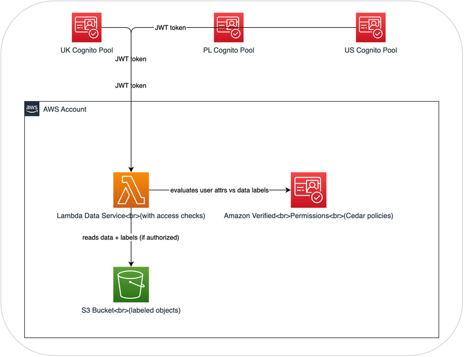

# Lab 2: Access Control (DCS Level 2)

## What's the problem?

In Lab 1, we built a data service that returns S3 objects along with their labels. It works, but it returns everything to everyone. The labels are there in the response, describing how the data should be handled, but nothing checks whether the caller should actually see it.

DCS Level 2 adds enforcement. A policy engine sits between the user and the data, checking the user's attributes (clearance, nationality, SAPs) against the data's labels before allowing access. The labels from Level 1 become the input to access decisions in Level 2.

## What you'll build

We'll take the data service from Lab 1 and add three things:
1. **User identity** -- Cognito user pools (one per nation) with custom attributes for clearance, nationality, and SAPs
2. **A policy engine** -- Amazon Verified Permissions with Cedar policies that express the access rules
3. **Access checking in the Lambda** -- before returning data, the Lambda asks Verified Permissions "should this user see this?"

The data stays in S3 with the same labels from Lab 1. The Lambda is the same function, modified to check policies before returning data. The new pieces are Cognito (identity) and Verified Permissions (policy engine).

## What you'll learn

- How a policy engine separates access logic from application code
- How Cedar policies express clearance/nationality/SAP checks declaratively
- How multiple identity providers (one per nation) federate into a single system
- How you can change access rules on the fly without redeploying anything
- Why this is still not enough (the data itself is still unencrypted)

## Architecture

## Before you start

- Completed Lab 1 (you need the S3 bucket with labeled objects and the Lambda function)
- AWS Console access with admin permissions
- Same region as Lab 1
- About 45 minutes

Let's go. **[Step 1: Set Up Identity Providers](step1-cognito.md)**
