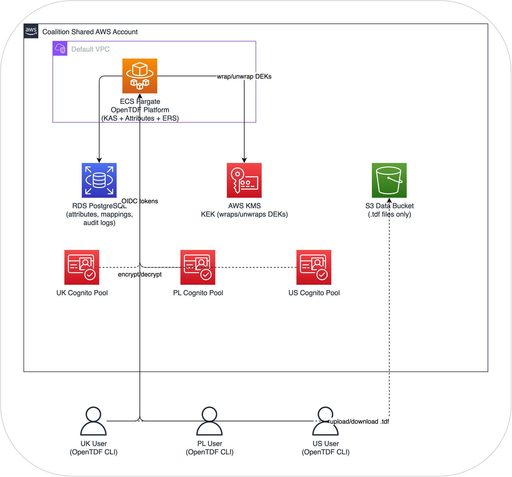

# Lab 3: Encryption (DCS Level 3)

## What's the problem?

In Labs 1 and 2, the data sitting in S3 is plaintext. Anyone with S3 access -- an admin, a compromised credential, a misconfigured bucket policy -- can read everything. The labels are there, the policy engine checks access, but the data itself is wide open to anyone who bypasses the application layer.

DCS Level 3 fixes this. The data is encrypted before it ever reaches S3. The encryption key is wrapped by KMS and can only be unwrapped by a Key Access Server (KAS) that checks the user's attributes against the data's policy first. No one -- not a cloud administrator, not an insider with privileged access, not a compromised service account -- can read the data without passing the KAS policy check.

## What you'll build

We'll deploy the OpenTDF platform as a single container and connect it to the Cognito user pools and a KMS key:

1. **OpenTDF platform** running as an ECS Fargate task, the Key Access Server that controls who can decrypt what
2. **AWS KMS** as the root key store, hardware-backed keys that wrap the data encryption keys
3. **Cognito** (from Lab 2) as the identity provider, authenticates users and asserts their attributes
4. **OpenTDF CLI** on your workstation, encrypts and decrypts TDF files locally

## What you'll learn

- How TDF wraps data with encryption and an embedded access policy
- How a Key Access Server enforces policies at decryption time (not storage time)
- How Cognito tokens carry user attributes that the KAS evaluates
- How KMS provides hardware-backed key management with full CloudTrail audit
- Why this is fundamentally different from Labs 1 and 2: the data protects itself

## What's different from Labs 1 and 2

| Aspect | Lab 1 | Lab 2 | Lab 3 |
|--------|-------|-------|-------|
| Can S3 admin read data? | Yes | Yes | **No** |
| Can a privileged insider read data? | Yes | Yes | **No** (would need to also compromise KAS) |
| Protection after data is copied? | No | No | **Yes** |
| Labels bound to data? | No (advisory tags) | No (S3 tags) | **Yes** (cryptographic binding in TDF) |
| Policy enforced by | Nothing | Verified Permissions | **KAS at decryption time** |

## Before you start

- Completed Labs 1 and 2 (you need the S3 bucket, Cognito user pools, and test users)
- AWS Console access with admin permissions
- Same region as previous labs
- About 45 minutes

!!! warning "Cost"
    This lab runs an ECS Fargate task and a small RDS instance. Budget roughly $1-2/day. Make sure to clean up when you're done (see the Wrap-Up section).

## Concepts for this lab

- **Data Encryption Key (DEK)**: A unique AES-256 key generated for each piece of data. The DEK encrypts the actual content.

- **Key Encryption Key (KEK)**: An AWS KMS key that wraps (encrypts) the DEK. The KEK never leaves the KMS hardware module.

- **Wrapped DEK**: The DEK encrypted by the KEK. Stored in the TDF file alongside the encrypted data. Useless without KAS authorization to unwrap it.

- **TDF file**: A ZIP archive containing the encrypted payload and a manifest with the wrapped DEK, access policy, and security labels.

- **Key Access Server (KAS)**: The gatekeeper. Receives a user's OIDC token and a wrapped DEK, checks the user's attributes against the data's policy, and only releases the unwrapped DEK if the policy is satisfied.

Let's build it. **[Step 1: Create the Key Store](step1-kms.md)**
