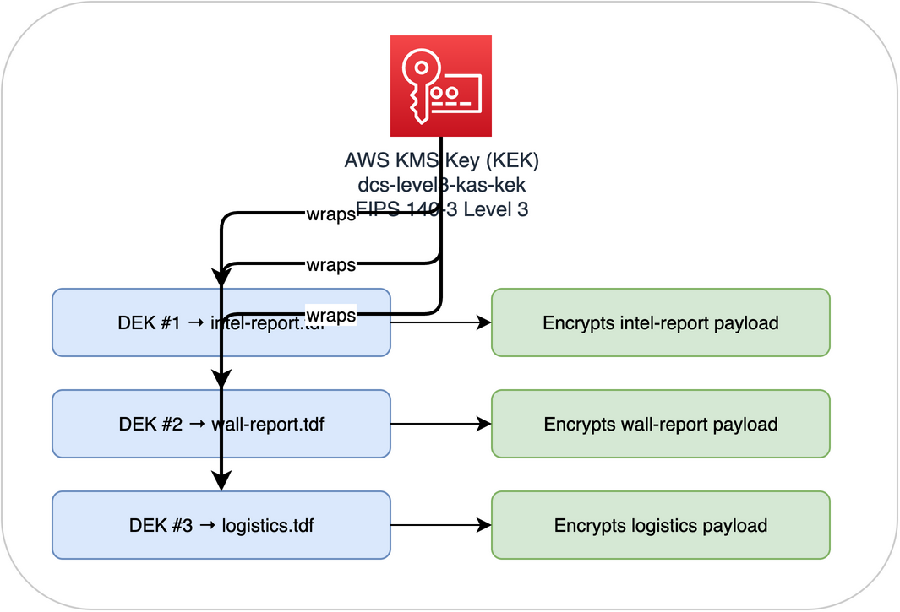

# Step 1: Create the Key Store

AWS KMS provides the root of the key hierarchy. The KMS key (Key Encryption Key / KEK) wraps and unwraps the Data Encryption Keys (DEKs) that protect individual TDF files. The KEK itself never leaves the KMS hardware security module.

## Why KMS?

- **Hardware-backed**: Keys stored in FIPS 140-3 Level 3 validated HSMs
- **Audit logged**: Every use of the key is recorded in CloudTrail
- **Access controlled**: Key policies define exactly which IAM roles can use the key
- **Rotation**: Automatic annual key rotation available

This mirrors the hardware security modules used in defence environments for key management.

## Create the KMS key

1. Go to **KMS Console**: [https://console.aws.amazon.com/kms](https://console.aws.amazon.com/kms)
2. Click **Create key**
3. **Key type**: Symmetric
4. **Key usage**: Encrypt and decrypt
5. Click **Next**
6. **Alias**: `dcs-level3-kas-kek`
7. **Description**: `Key Encryption Key for DCS Level 3 KAS - wraps TDF Data Encryption Keys`
8. Click **Next**
9. **Key administrators**: Select your IAM user/role
10. Click **Next**
11. **Key usage permissions**: Select your IAM user/role for now. We'll add the ECS task role in the next step.
12. Click **Next** > **Finish**

## Note the Key ID

Copy the **Key ID** from the key details page (a UUID like `12345678-abcd-1234-efgh-123456789012`). You'll need this when configuring the OpenTDF platform.

## The key hierarchy

Each TDF file gets its own unique DEK. The DEK is generated by the OpenTDF CLI, used to encrypt the data payload (AES-256-GCM), then wrapped by KMS. The wrapped DEK is stored in the TDF manifest. To decrypt, the KAS sends the wrapped DEK to KMS for unwrapping, but only after verifying the user's attributes against the data's policy.

Next: **[Step 2: Deploy the Key Access Server](step2-kas.md)**
