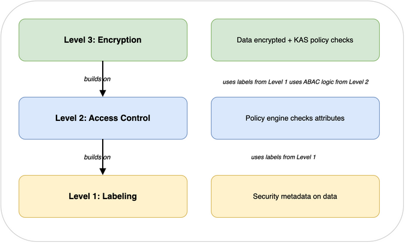

# The three DCS levels

DCS is organized into three levels. Each level adds more protection. You don't need all three for every situation, but understanding all three helps you choose the right level for your needs.

## Level 1: Labeling (Control)

**What it does:** Attaches security metadata to data.

**Analogy:** Putting a "CLASSIFIED" stamp on a document. The stamp tells people how to handle it, but it doesn't physically prevent anyone from reading it.

**How it works:**

- Every piece of data gets a label: classification level, who can access it, what special access is needed
- Labels are machine-readable (not just a text stamp - structured data that systems can process)
- Labels follow a standard format so different systems can understand them

**What it doesn't do:** Labels alone don't stop anyone from reading the data. If someone ignores the label, there's no enforcement. Think of it as a "please handle with care" sticker.

There are two variants of Level 1:

- Basic Level 1: Labels are metadata attached to data (like S3 tags). They're advisory, useful for internal systems where you trust the applications, but anyone with the right permissions can change them silently.
- Assured Level 1: Labels are cryptographically bound to data using digital signatures (NATO STANAG 4778). Any tampering with labels or data is detectable. This is what you need for cross-organizational or coalition data sharing.

In this workshop, Lab 1 builds basic Level 1 to teach the concepts. The architecture references show how to build assured Level 1.

**When basic is enough:** Internal systems where you trust the applications to respect labels. Labeling is also the foundation for Levels 2 and 3.

**When you need assured:** Sharing data across organizational boundaries, coalition operations, or any scenario where you can't trust that labels haven't been tampered with.

---

## Level 2: Access Control (Protect)

**What it does:** Enforces access decisions based on labels and user attributes.

**Analogy:** A security guard who checks your badge against the label on the door before letting you in.

**How it works:**

- A **policy engine** sits between users and data
- When someone requests data, the engine checks: does this person's clearance match the data's classification? Is their nationality on the list? Do they have the right codewords?
- Access is granted or denied based on these attribute checks
- This is called Attribute-Based Access Control (ABAC)

**What it doesn't do:** The data itself is still stored in plain text. Anyone who bypasses the policy engine (e.g., a database administrator with direct access) can read everything.

**When it's enough:** When you trust your infrastructure and want to add fine-grained access control on top. Good for internal systems where the application layer is the only way to access data.

## Level 3: Encryption (Protect + Share)

**What it does:** Encrypts data so it's unreadable without authorization. Policies are checked when someone tries to decrypt, not when they try to download.

**Analogy:** Putting a document in a locked safe where the combination is held by a Key Access Server. The server only gives you the combination after checking your credentials against the document's rules.

**How it works:**

1. Data is encrypted with a unique key (the Data Encryption Key, or DEK)
2. The DEK is wrapped (encrypted again) by a Key Access Server (KAS)
3. The wrapped DEK, the encrypted data, and the access policy are packaged together in a TDF (Trusted Data Format) file
4. When someone wants to read the data, they send the wrapped DEK to the KAS
5. The KAS checks: does this person meet the policy requirements?
6. If yes, the KAS unwraps the DEK and sends it back
7. The person's software uses the DEK to decrypt the data

**What this gives you:**

- Even if someone steals the TDF file, they can't read it
- Even if someone has admin access to the storage system, they can't read it
- Even if a bad actor within your cloud provider, your own organization, or a partner gains access to the storage layer, they only get ciphertext
- The only way to read the data is through the KAS, which checks the policy every time

**When you need it:** When data crosses organizational boundaries, when you need to mitigate the risk of insider threats (whether within your own organization, a partner, or a cloud provider), or when you need protection that persists after data leaves your systems.

## How the levels build on each other

In this workshop, you'll build all three levels on AWS so you can see exactly how they work and how they fit together.
