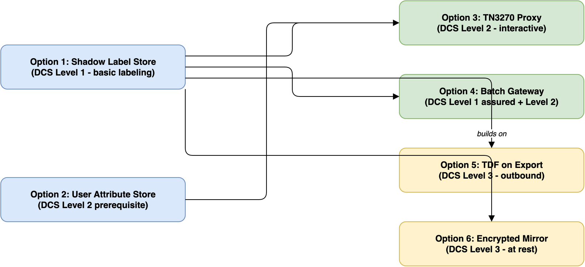

# Solutions: Legacy System DCS Retrofit (Scenario 03)

This section explores how to apply data-centric security to a specific legacy application: the NATO Joint Logistics Tracking System (JLTS), a COBOL/DB2 application that has been in continuous operation since 2004.

## The legacy application

- [JLTS Application Profile](legacy-app-profile.md) -- Detailed description of the legacy application, its architecture, data model, and operational context

## DCS retrofit components

The retrofit is broken into six components. The first four handle labeling and access control (DCS Levels 1 and 2). The last two add cryptographic protection (DCS Level 3). Each addresses a different aspect of the DCS challenge:

- [Option 1: Shadow Label Store](option-1-shadow-label-store.md) -- DB2 metadata tables holding classification labels for all JLTS records (DCS Level 1 foundation)
- [Option 2: User Attribute Store](option-2-user-attribute-store.md) -- Security attributes (clearance, nationality, SAPs) mapped to RACF user IDs (DCS Level 2 prerequisite)
- [Option 3: TN3270 Security Proxy](option-3-tn3270-security-proxy.md) -- Protocol-aware proxy that filters 3270 screens based on labels and user attributes (DCS Level 2 enforcement for interactive access)
- [Option 4: Batch and Export Gateway](option-4-batch-export-gateway.md) -- Filtering and STANAG 4778 assured labeling for outbound data feeds and reports (DCS Level 1 assured + Level 2 for batch data)
- [Option 5: TDF Encryption on Export](option-5-tdf-export-encryption.md) -- TDF-wrapping outbound data with ABAC policies for cryptographic protection in transit and at rest on receiving systems (DCS Level 3 for exports)
- [Option 6: Encrypted Data Mirror](option-6-encrypted-data-mirror.md) -- Off-mainframe TDF-encrypted replica of JLTS data for compliance, DR, cloud migration, and cross-domain sharing (DCS Level 3 at rest)

### Dependency map

Options 1 and 2 can be built in parallel. Option 3 depends on both. Option 4 depends on Option 1. Option 5 builds on Option 4. Option 6 depends on Option 1 and can be built independently of Options 3-5.

### Coverage summary

| Component | What it protects | DCS Level |
|---|---|---|
| Option 1: Shadow labels | Nothing (labels only) | Level 1 (basic) |
| Option 2: User attributes | Nothing (attributes only) | Level 2 prerequisite |
| Option 3: TN3270 proxy | Interactive access | Level 2 |
| Option 4: Export gateway | Outbound batch data | Level 1 (assured) + Level 2 |
| Option 5: TDF on export | Outbound batch data | Level 3 |
| Option 6: Encrypted mirror | Data at rest (replica) | Level 3 |

The live DB2 database remains the one gap -- protected by Level 2 access control (the proxy) but not Level 3 encryption. That's the trade-off of retrofitting a system that can't be rewritten.

## Supporting material

- [Classification Engine Context](context-classification-engine.md) -- Context document for a focused discussion on how to automatically classify and label JLTS data (the "how do we determine the correct label?" problem)
