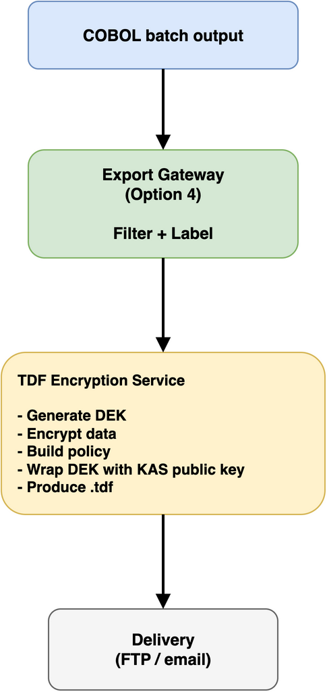
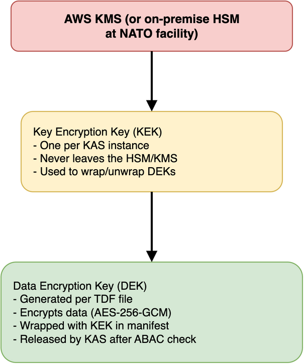

# Option 5: TDF encryption on export (DCS Level 3)

## Solution overview

This option extends the batch export gateway (Option 4) to wrap outbound data in TDF (Trusted Data Format) with ABAC policies derived from the shadow label store. Data inside JLTS DB2 stays unencrypted -- the COBOL application and TN3270 proxy continue to work as before. But once data leaves JLTS, it carries its own cryptographic protection and access policy, regardless of where it ends up.

For a legacy system that was never designed for encryption, this is about as close to Level 3 as you can get without rewriting the application.

## Scenario reference

**Addresses**: Scenario 03 -- Legacy System DCS Retrofit
**DCS Level**: Level 3 (Encryption with cryptographic access control)
**Dependencies**: Option 1 (shadow label store), Option 4 (batch export gateway)
**Builds on**: The export gateway already filters and labels outbound data. This option adds encryption and policy binding on top.

## Why not encrypt inside DB2?

We're not trying to encrypt data in the live database. Here's why.

JLTS has 340,000 lines of COBOL with static SQL compiled into load modules. Every SELECT statement is baked into the binary. If you encrypt a column value, every program that reads that column breaks. You'd need to recompile every affected program with decryption logic, which means modifying COBOL code -- the one thing the scenario says we can't do.

DB2 for z/OS does support column-level encryption natively (ENCRYPT_TDES, ENCRYPT_AES functions), but that's transparent encryption managed by DB2 itself, not policy-based encryption with ABAC. It protects against someone stealing the disk, not against an over-privileged user running a query.

TDF encryption with KAS-enforced ABAC policies is a different thing entirely. It requires a client that understands TDF, can talk to a KAS, and can present user attributes for policy evaluation. A COBOL program running a CICS transaction cannot do any of that. Neither can a 3270 terminal emulator.

So we encrypt at the boundary where data leaves the legacy world and enters systems that can handle TDF.

## How it works

### The encryption point

The batch export gateway (Option 4) already does this for each outbound data flow:

1. Reads raw output from COBOL batch programs
2. Looks up classification labels from the shadow store
3. Filters records and fields based on recipient attributes
4. Applies STANAG 4778 metadata labels
5. Delivers the filtered, labeled output

This option adds a step between 4 and 5:

### Policy derivation

The TDF policy for each export is derived from the shadow labels. The gateway already knows the classification and releasability of the data it's exporting. That metadata maps directly to TDF ABAC attributes:

| Shadow label field | TDF attribute |
|---|---|
| `ROW_CLF` = NS | `classification/value/SECRET` |
| `NATL_CAV` = REL_TO:FRA,GBR | `releasable/value/FRA`, `releasable/value/GBR` |
| SAP requirement = WALL | `sap/value/WALL` |

For a national feed (e.g., the French nightly feed), the policy is straightforward: the entire feed file is wrapped as a single TDF with a policy matching the French system's attributes. The French receiving system authenticates to the KAS, presents its attributes, and gets the DEK to decrypt.

For mixed-classification exports (e.g., a weekly report containing records at different levels), there are two approaches:

**One TDF per classification level**: Split the export into separate files by classification, each wrapped with the appropriate policy. The French system gets a CONFIDENTIAL TDF and a RESTRICTED TDF, but not a SECRET TDF. Simple, but produces multiple files where there used to be one.

**Single TDF at highest level**: Wrap the entire (already filtered) export as one TDF at the highest classification present. The filtering already removed anything the recipient shouldn't see, so the TDF policy just needs to match the recipient's clearance. Simpler operationally, but the TDF policy is coarser than the actual content.

The second approach is more practical for JLTS. The filtering (Option 4) handles granularity; the TDF handles cryptographic protection of the filtered output.

### KAS deployment

The KAS (Key Access Server) runs off-mainframe. It doesn't need to be on the z/OS system -- it just needs to be reachable from the encryption service and from the receiving national systems.

Two deployment models:

**Centralised KAS**: A single KAS operated by the JLTS hosting organisation (e.g., at the NATO facility). All national systems authenticate to this KAS to decrypt their feeds. The KAS enforces ABAC policies and logs every access.

**Federated KAS**: Each receiving nation operates their own KAS. The TDF encryption service wraps the DEK with multiple KAS public keys (one per recipient nation), so each nation can decrypt using their own KAS. This matches the federated model from the Level 3 architecture and gives each nation sovereignty over their key management.

For JLTS, the centralised model is simpler to start with. Federation can come later if national sovereignty requirements demand it.

### Key hierarchy

### What the receiving system needs

Each national system that currently receives a flat file via FTP now receives a .tdf file instead. To decrypt it, the receiving system needs:

1. A TDF client library (OpenTDF SDK available in Java, JavaScript, Go)
2. Network access to the KAS
3. An identity token (OIDC) with attributes matching the TDF policy
4. Integration into their existing ingest pipeline

This is a real change for the receiving national systems. They need to add TDF decryption to their ingest process. Eight national systems with bespoke flat-file parsers built over 20 years -- getting all of them to change is going to be slow. Each nation needs to:

- Install the TDF SDK
- Configure their system to authenticate to the KAS
- Modify their ingest pipeline to decrypt before parsing
- Test that the decrypted output matches the format they expect

The decrypted content is identical to what they currently receive (same flat-file format, same record layout). Only the delivery wrapper changes.

### Batch reports

Weekly summary reports can be wrapped as TDF files and distributed via secure email. Recipients use a TDF-aware viewer or decrypt locally before reading. This is simpler than the national feed case because reports are typically consumed by humans, not automated systems.

## What this achieves

Once data leaves JLTS as a TDF, the security properties change substantially. The data is AES-256-GCM encrypted -- intercepting the file gets you ciphertext. The access policy is cryptographically bound to the encrypted data, so it can't be tampered with. Decryption requires authenticating to a KAS and passing an ABAC policy check; having the file alone isn't enough.

Every decryption attempt is logged by the KAS, so there's a complete record of who accessed what and when. If a recipient's clearance is revoked, the KAS stops releasing keys -- already-distributed TDF files become inaccessible to that recipient. And if the French logistics system is compromised, the attacker gets TDF files they can't decrypt without the KAS.

## What this does not achieve

- Data inside JLTS DB2 is still unencrypted. The TN3270 proxy (Option 3) provides Level 2 access control for interactive users, but there's no Level 3 protection for data at rest on the mainframe.
- If someone with DB2 admin access queries the live tables, they see plaintext. The shadow labels tell you what's sensitive, the proxy blocks unauthorised interactive access, but the data itself isn't cryptographically protected.
- Batch processing within JLTS (internal reports, reconciliation jobs) operates on plaintext data. Only data that crosses the export boundary gets TDF protection.

This is a deliberate trade-off. Encrypting data inside a running COBOL/DB2 system is impractical (as discussed above). The export boundary is where TDF makes sense.

## Advantages

1. Zero changes to COBOL application or DB2 schema
2. Builds directly on the existing export gateway (Option 4) -- incremental addition, not a new system
3. Data protected in transit and at rest on receiving systems
4. ABAC policy enforcement at decryption time, not just at export time
5. Revocable access -- KAS can stop releasing keys to compromised or deauthorised recipients
6. Full audit trail of every decryption via KAS logs
7. Standards-based (OpenTDF/ZTDF, NATO-standardised as of March 2024)

## Disadvantages

1. Does not protect data at rest inside JLTS (DB2 remains unencrypted)
2. Requires all 8 receiving national systems to adopt TDF decryption -- coordination overhead
3. Adds a KAS dependency -- if the KAS is down, nobody can decrypt new exports
4. Key management infrastructure needed (KMS or HSM, KAS deployment, certificate management)
5. Receiving systems need network access to KAS for decryption (online requirement)
6. Increases complexity of the export pipeline

## Acceptance criteria coverage

From Scenario 03:

- ✅ AC1: Automatic Content Labeling -- labels from Option 1, STANAG 4778 binding from Option 4, TDF policy binding from this option
- ✅ AC3: Policy-Based Access Control -- KAS enforces ABAC at decryption time
- ✅ AC4: Dynamic Content Filtering -- filtering from Option 4, cryptographic enforcement from TDF
- ✅ AC7: Seamless Integration -- no changes to legacy application
- ✅ AC8: Performance -- batch processing, no interactive latency impact
- ✅ AC9: Comprehensive Audit Trail -- KAS logs every key access request
- ⚠️ AC11: Accuracy and Reliability -- depends on label quality from Option 1

## Technology stack

- OpenTDF platform (KAS, attribute service) -- deployed on AWS or on-premise at NATO facility
- OpenTDF SDK (Java, JavaScript, or Go) -- for encryption in the gateway and decryption at receiving systems
- AWS KMS or on-premise HSM -- key encryption key management
- OIDC identity provider -- for receiving system authentication to KAS (could be the same Cognito setup from the labs, or a NATO identity service)

## Implementation complexity

**Complexity**: Medium-High

The encryption service itself is straightforward if you're familiar with the OpenTDF SDK. The complexity is in:
- Deploying and operating a KAS within the NATO SECRET domain
- Coordinating with 8 national systems to adopt TDF decryption
- Key management and certificate lifecycle
- Testing that decrypted output matches expected formats
- High-availability for the KAS (it's now in the critical path for all data consumers)

---

*Adds DCS Level 3 cryptographic protection to data leaving JLTS. Builds on Options 1 and 4. Does not protect data at rest inside DB2 -- for that, see Option 6 (encrypted data mirror).*
