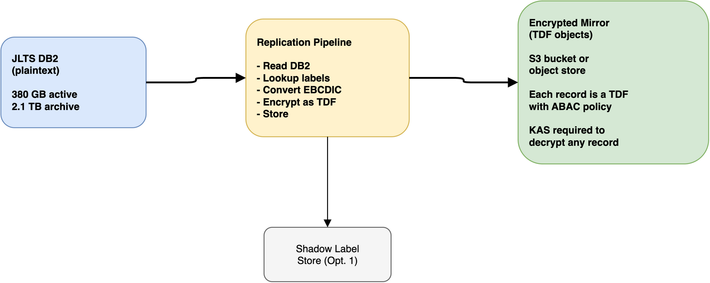

# Option 6: Encrypted data mirror (DCS Level 3 at rest)

## Solution overview

This option creates an off-mainframe replica of JLTS data where every record is stored as a TDF object with ABAC policies derived from the shadow label store. The live DB2 database continues to serve the COBOL application and TN3270 proxy as before. The encrypted mirror is a separate data store -- on AWS, on-premise, or both -- where the same data exists in a cryptographically protected form.

Option 5 deliberately leaves data at rest inside JLTS unaddressed. This option fills that gap.

## Scenario reference

**Addresses**: Scenario 03 -- Legacy System DCS Retrofit
**DCS Level**: Level 3 (Encryption with cryptographic access control) for data at rest
**Dependencies**: Option 1 (shadow label store)
**Complements**: Option 5 (TDF on export) handles outbound flows; this option handles the data store itself

## The gap Option 5 leaves

Option 5 encrypts data as it leaves JLTS. That's good for protecting data in transit and at rest on receiving systems. But the 380 GB of active data and 2.1 TB of archived data sitting in DB2 remains unencrypted. If someone compromises the mainframe, gains DB2 admin access, or physically accesses the storage, they get everything in plaintext.

For many organisations, this is an acceptable risk -- the mainframe is in a NATO facility, on a classified network, behind physical security. The data has survived 20 years without encryption. But for compliance with DCS Level 3 requirements, or for scenarios where the data needs to move to less-trusted infrastructure (cloud migration, disaster recovery site, coalition shared storage), you need the data itself to be cryptographically protected.

That's what the encrypted mirror provides.

## How it works

### Replication pipeline

A batch process runs on a schedule (nightly, or more frequently for high-priority tables) and does the following:

1. Reads records from JLTS DB2 (using a read-only DB2 connection or change data capture)
2. Looks up the shadow label for each record (Option 1)
3. Converts the record from EBCDIC to UTF-8 and serialises it (JSON, or a structured format that preserves the original field layout)
4. Generates a TDF policy from the shadow label (classification, releasability, SAP requirements)
5. Encrypts the serialised record as a TDF object using the OpenTDF SDK
6. Stores the TDF object in the mirror (S3, on-premise object store, or a database with TDF blobs)
7. Maintains an index mapping JLTS primary keys to TDF object locations

### Granularity: what becomes a TDF object?

There are three options, each with different trade-offs:

**Record-level TDF** (one TDF per DB2 row): Each row in each table becomes a separate TDF object. A supply request record becomes `SR-00421.tdf`. This gives the finest granularity -- each record has its own policy, and access to one record doesn't grant access to others.

- Pro: per-record access control, per-record audit trail
- Con: 480,000 TDF objects for active data alone, plus 15 million for archives. That's a lot of objects to manage, and a lot of KAS calls to decrypt a query result set.

**Table-partition TDF** (one TDF per logical group of records): Group records by table and classification level. All NATO SECRET supply requests become one TDF. All NATO CONFIDENTIAL supply requests become another. Fewer objects, coarser policies.

- Pro: manageable number of objects, simpler to query
- Con: accessing one SECRET supply request means decrypting all of them. Over-grants access within a classification level.

**Document-level TDF** (one TDF per logical entity): Group related records into a logical "document." A supply request and its associated movement records, status updates, and remarks become a single TDF. This mirrors how users think about the data.

- Pro: matches operational use patterns, reasonable number of objects
- Con: requires understanding the data model well enough to define logical entities. Cross-entity queries require decrypting multiple TDFs.

**Recommendation**: Table-partition TDF for the initial implementation. It's the simplest to build and produces a manageable number of objects (roughly: 147 tables × a handful of classification levels = low hundreds of TDF objects for active data). Record-level TDF is the long-term goal if per-record access control is needed, but it's a significant scaling challenge.

### Synchronisation

The mirror needs to stay reasonably current with the live DB2. Options:

**Nightly batch sync**: Run the replication pipeline after the nightly batch processing completes. The mirror is at most 24 hours behind the live system. Simple, fits the existing batch schedule, and the mainframe team understands batch jobs.

**Change data capture (CDC)**: Use DB2's built-in log-based CDC to detect inserts, updates, and deletes, and replicate changes to the mirror in near-real-time. More current, but more complex to set up and operate.

**Recommendation**: Nightly batch sync to start. CDC if the organisation needs the mirror to be more current (e.g., for disaster recovery with a tighter RPO).

### What the mirror enables

Once the encrypted mirror exists, it opens up use cases that the live DB2 system can't support:

**Compliance demonstration**: An auditor can verify that all JLTS data exists in a DCS Level 3 compliant form. The TDF objects have cryptographically bound policies, the KAS enforces ABAC, and every access is logged. This satisfies Level 3 requirements even though the live operational system runs at Level 2.

**Cloud migration path**: If JLTS data eventually needs to move to cloud infrastructure (AWS, Azure), the TDF objects can go into S3 or Blob Storage without worrying about the cloud provider accessing the data. The data is self-protecting. For an organisation that's been burned twice on JLTS replacement programmes, being able to move the data to modern infrastructure without a security re-accreditation is worth a lot.

**Cross-domain sharing**: The mirror can feed data to cross-domain solutions. A guard or sanitisation service (Scenario 04) can pull TDF objects from the mirror, decrypt them with appropriate authorisation, sanitise, and re-encrypt at a lower classification.

**Disaster recovery**: The encrypted mirror can be stored at a secondary site without the same physical security requirements as the primary mainframe facility. Because the data is encrypted, the DR site doesn't need to be in a NATO SECRET facility -- it just needs to be available.

**Decommissioning path**: When JLTS is eventually replaced (attempt number three), the encrypted mirror provides a standards-based archive of all historical data. Future systems can access it through the KAS without needing to understand DB2, EBCDIC, or COBOL record layouts.

### KAS deployment

Same as Option 5 -- the KAS runs off-mainframe and manages key access for both the export TDFs and the mirror TDFs. A single KAS instance can serve both purposes. The key hierarchy is shared.

If the mirror is stored on AWS, the KAS can run on ECS Fargate with KMS-backed keys, matching the Level 3 lab architecture. If the mirror is on-premise, the KAS runs on local infrastructure with an HSM.

## What this does not change about JLTS operations

The live JLTS system is completely unaffected:

- COBOL programs read and write DB2 as before
- The TN3270 proxy (Option 3) provides Level 2 access control for interactive users
- Batch processing runs as before
- The export gateway (Option 4/5) handles outbound data flows

The encrypted mirror is a read-only replica. It doesn't feed back into JLTS. It's a one-way flow: DB2 → mirror. The mirror is consumed by external systems, compliance processes, and future migration efforts -- not by the COBOL application.

## Advantages

1. Achieves DCS Level 3 for JLTS data at rest without touching the live system
2. Enables cloud storage of classified data (data is self-protecting)
3. Provides a standards-based archive for eventual JLTS decommissioning
4. Disaster recovery at a lower-security facility becomes possible
5. Cross-domain sharing and sanitisation can consume TDF objects from the mirror
6. Full audit trail of every access to mirrored data via KAS logs
7. Revocable access -- compromised systems can be cut off by updating KAS policies

## Disadvantages

1. Storage cost: duplicating 380 GB active + 2.1 TB archive as TDF objects, plus the overhead of TDF metadata and encryption
2. Synchronisation lag: mirror is hours behind the live system (nightly sync) or minutes behind (CDC)
3. Replication pipeline complexity: EBCDIC conversion, label lookup, TDF encryption for every record
4. Query performance: searching across TDF objects is much slower than querying DB2 directly. The mirror is not a replacement for the live database as an operational data store.
5. KAS availability: if the KAS is down, the entire mirror is inaccessible
6. Initial backfill: encrypting 2.1 TB of archived data takes time (days to weeks depending on throughput)

## Acceptance criteria coverage

From Scenario 03:

- ✅ AC1: Automatic Content Labeling -- TDF policies derived from shadow labels
- ✅ AC3: Policy-Based Access Control -- KAS enforces ABAC at decryption time
- ✅ AC7: Seamless Integration -- no changes to legacy application
- ✅ AC8: Performance -- batch replication, no impact on interactive performance
- ✅ AC9: Comprehensive Audit Trail -- KAS logs every access to mirrored data
- ⚠️ AC4: Dynamic Content Filtering -- the mirror stores complete records; filtering happens at the consumer, not in the mirror itself
- ⚠️ AC11: Accuracy and Reliability -- depends on label quality from Option 1

## Technology stack

- Replication pipeline: Java or Python batch process running on z/OS (via z/OS Java batch) or off-mainframe with a DB2 Connect client
- OpenTDF SDK: for TDF encryption
- Object storage: AWS S3, on-premise MinIO, or similar
- KAS: OpenTDF platform (shared with Option 5)
- Index/catalog: database or search index mapping JLTS keys to TDF object locations
- EBCDIC conversion: IBM JTOpen or similar library

## Implementation complexity

**Complexity**: Medium

The replication pipeline is conceptually simple (read, convert, encrypt, store). The complexity is in:
- EBCDIC to UTF-8 conversion for all 147 tables (character encoding edge cases)
- Mapping the DB2 schema to a sensible JSON structure (those 8-character column names need human-readable mappings)
- Initial backfill of 2.5 TB of data
- Ongoing sync without impacting mainframe batch windows
- Object storage sizing and cost management

## Relationship to other options

This option works alongside the others, not instead of them:

| Component | What it protects | DCS Level |
|---|---|---|
| Option 1: Shadow labels | Nothing (labels only) | Level 1 (basic) |
| Option 2: User attributes | Nothing (attributes only) | Level 2 prerequisite |
| Option 3: TN3270 proxy | Interactive access | Level 2 |
| Option 4: Export gateway | Outbound batch data | Level 1 (assured) + Level 2 |
| Option 5: TDF on export | Outbound batch data | Level 3 |
| Option 6: Encrypted mirror | Data at rest (replica) | Level 3 |

The full stack (Options 1-6) gives you: labeled data (Level 1), access-controlled interactive sessions (Level 2), assured-labeled and encrypted exports (Level 3), and an encrypted at-rest replica (Level 3). The live DB2 remains the one gap -- it's protected by Level 2 access control but not Level 3 encryption. That's the trade-off of retrofitting a system that can't be rewritten.

---

*Creates a DCS Level 3 encrypted replica of JLTS data for compliance, cloud migration, disaster recovery, and cross-domain sharing. Complements Option 5 (TDF on export) which protects outbound data flows. The live DB2 system is unaffected.*
