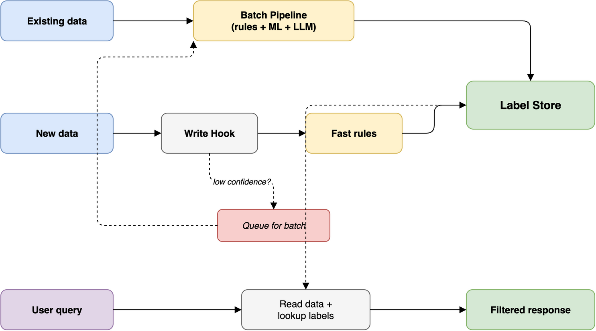

# Option 2: hybrid batch + classify-on-write

## Concept

Combine batch classification for existing and historical data with classify-on-write for new data entering the system. Fast rule-based methods run at write time; expensive methods (ML, LLM, human review) are reserved for the batch pipeline. This closes the gap problem from pure batch (new data has no labels) without putting a full classification engine in the query path.



## How it works

### Existing data (retroactive classification)

1. The batch pipeline works through the backlog of unclassified records
2. It uses the full classification stack: schema rules, pattern matching, ML models, LLM analysis, human review
3. Labels go into the label store with confidence scores
4. After the initial backlog is cleared, the pipeline runs incrementally on whatever the write-time classification flagged for re-review

### New data (classify-on-write)

1. New data enters the system and hits a write hook (DB trigger, CICS exit, application-level interceptor)
2. Fast classification methods run synchronously: schema-based rules, pattern matching, known-field defaults
3. Labels from the fast methods are written to the label store immediately
4. If the fast methods produce a high-confidence result, classification is done
5. If confidence is low or the data contains free-text or ambiguous content, the record is also queued for batch processing
6. The batch pipeline later re-classifies with more expensive methods and updates the label if needed

### Queries

1. User makes a data request
2. System retrieves data and joins with labels from the label store
3. If a record has no label yet (edge case: just entered, write hook hasn't fired), a configurable default policy applies -- block, allow with warning, or classify synchronously
4. Access control filters the response based on labels and user attributes

## Confidence-based routing

The interesting design decision is how to route records between the write-time path and the batch path:

```
Record enters system
       │
       ▼
  Fast rules classify
       │
       ├── High confidence (≥ 0.9) → Store label, done
       │
       ├── Medium confidence (0.6-0.9) → Store provisional label + queue for batch
       │
       └── Low confidence (< 0.6) → Store conservative default + queue for batch + flag for review
```

### What "confidence" means in practice

For rule-based classification, confidence is deterministic:

- Rule matches exactly → confidence 1.0
- Field is a known type (grid ref, unit designator) → confidence 0.95
- Field matches a pattern but could be a false positive → confidence 0.7
- No rule matches, using table-level default → confidence 0.5
- Free-text field with no pattern match → confidence 0.3

The thresholds are tuneable. In a high-security environment, you'd lower the "high confidence" threshold so more records go through batch review.

## What works well

New data gets at least a provisional label immediately, so there's no gap where data exists without any classification. The batch pipeline handles the backlog at its own pace. Fast rules cover the easy 80% of records; expensive methods deal with the hard 20%. Labels also improve over time as the batch pipeline re-processes records that were initially classified with low confidence. And if the batch pipeline falls behind, the system still works -- it just has more provisional labels than final ones.

## What doesn't

This is the most complex architecture of the two options. You have two classification paths, confidence-based routing between them, provisional vs final labels, and cache invalidation when batch updates a label that was already set by the write hook.

There's also label churn to deal with. A record might be classified as NR by the write-time rules, then upgraded to NS by the batch LLM. Downstream systems need to handle label changes, and if someone already accessed that record at NR, you potentially have a security event to investigate.

Both the write hook and the batch pipeline need monitoring, scaling, and updating when classification rules change. Testing is harder too -- you need to test both paths and the interaction between them.

## Handling label updates

When the batch pipeline re-classifies a record that already has a write-time label:

| Scenario | Action |
|---|---|
| Batch agrees with write-time label | No change, update confidence score |
| Batch upgrades classification (e.g., NR → NS) | Update label, log the change, notify if record was already accessed at the lower classification |
| Batch downgrades classification (e.g., NS → NR) | Update label, log the change (less urgent but still auditable) |
| Batch adds caveats (e.g., adds REL TO restriction) | Update label, potentially trigger re-evaluation of past access decisions |

The upgrade case is the security-sensitive one. If a record was provisionally labelled NR and served to a user, then batch later determines it's NS, that's a potential security incident. The mitigation is to bias write-time rules toward over-classification -- conservative defaults that err on the side of restricting access.

## Applying this to legacy systems

For a legacy system like JLTS (COBOL/DB2), the hybrid approach maps reasonably well:

1. The batch pipeline processes the 480,000 active records and (selectively) the 15 million archived records
2. A write hook sits between the CICS transaction server and users, classifying new transactions as they're created
3. The label store is a new DB2 table (adding tables is allowed even if altering existing ones isn't)
4. EBCDIC conversion happens once in the write hook or pipeline, not on every query

The write hook for a mainframe system could be:

- A CICS exit or user exit that intercepts transactions
- A DB2 stored procedure that fires on insert/update
- An external proxy that intercepts the network protocol between CICS and the client

## When this fits

- Legacy systems with large backlogs of unclassified data AND ongoing new data entry
- Systems where some data is easy to classify (rules) and some is hard (needs ML/LLM/human review)
- Environments that need both immediate classification and high accuracy
- Systems where the operational risk of missing labels on new data is unacceptable

## When it doesn't

- Simple systems where pure batch is sufficient
- Systems with very low data volume (the pipeline overhead isn't justified)
- Teams without the capacity to maintain two classification paths
- Prototyping or proof-of-concept phases (start with batch, add the write hook later)

## AWS implementation sketch

Write-time path:

- API Gateway / ALB as proxy entry point (or Lambda triggered by DynamoDB Streams / Aurora CDC)
- Lambda for fast rule-based classification
- DynamoDB for label store (low-latency lookups)
- SQS for queuing low-confidence records to batch

Batch path:

- Step Functions for pipeline orchestration
- ECS/Fargate for classification compute
- SageMaker for ML model inference
- Bedrock for LLM-assisted classification
- Same DynamoDB label store (batch updates labels in place)

Shared:

- CloudWatch for monitoring both paths
- S3 for audit logs
- SNS for alerting on label upgrades (potential security events)
